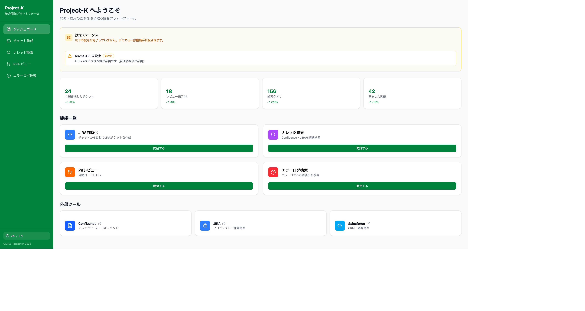
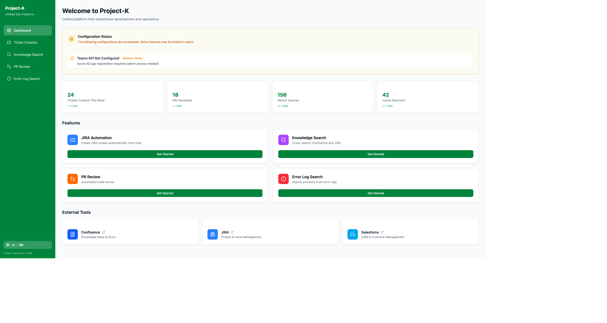
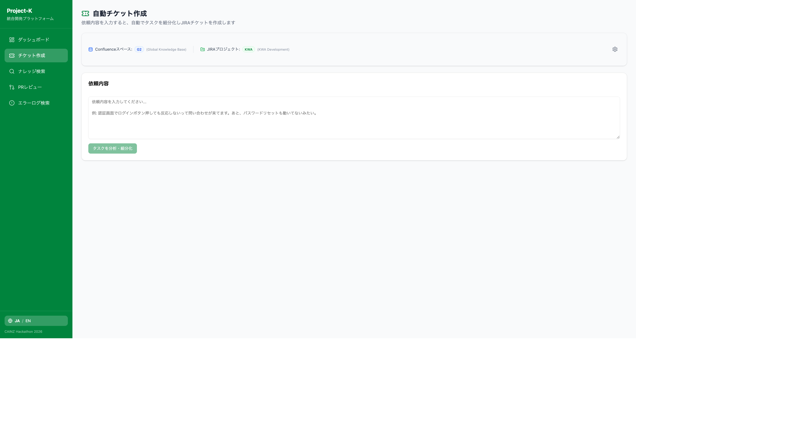
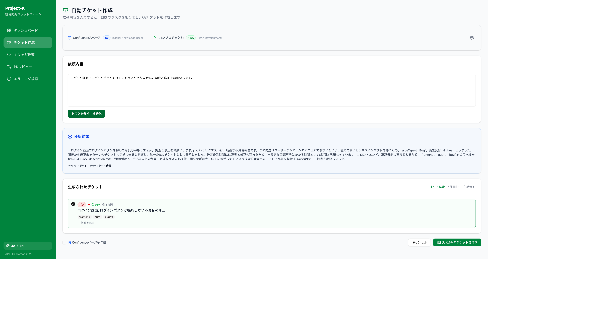
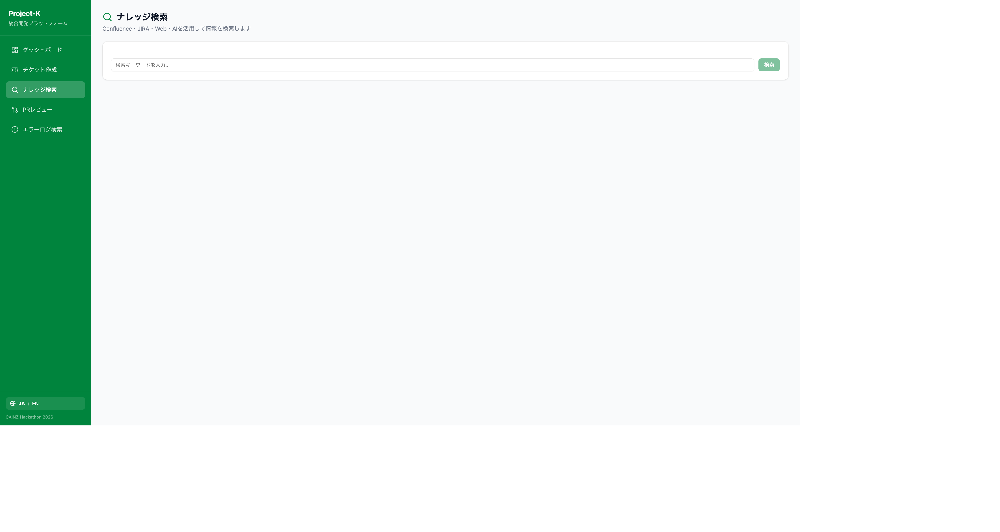
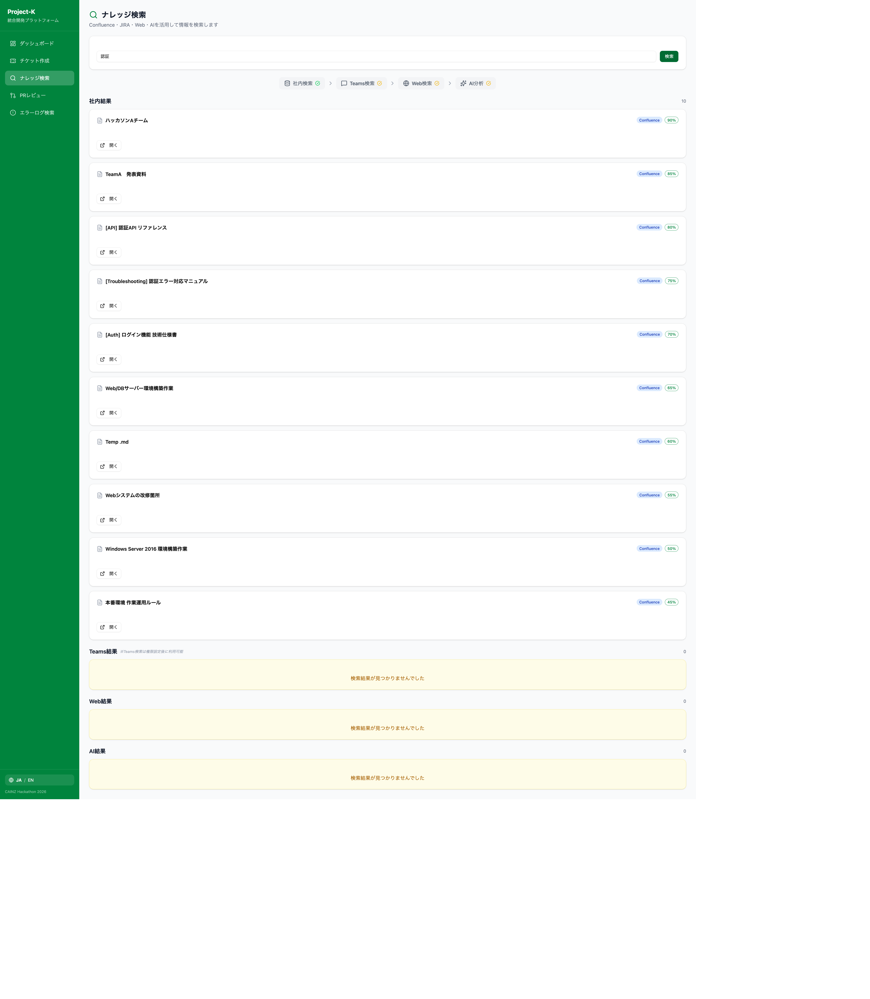
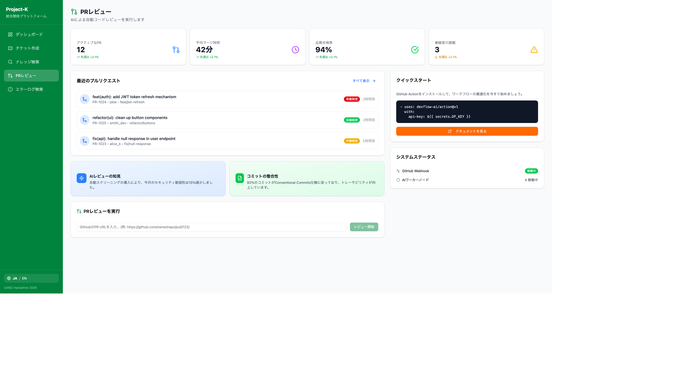
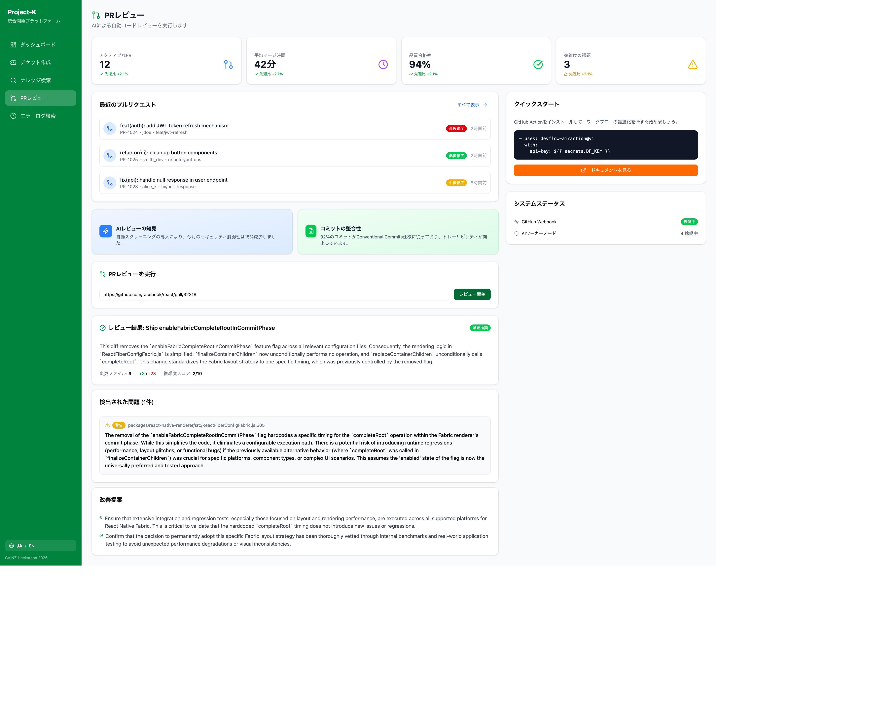
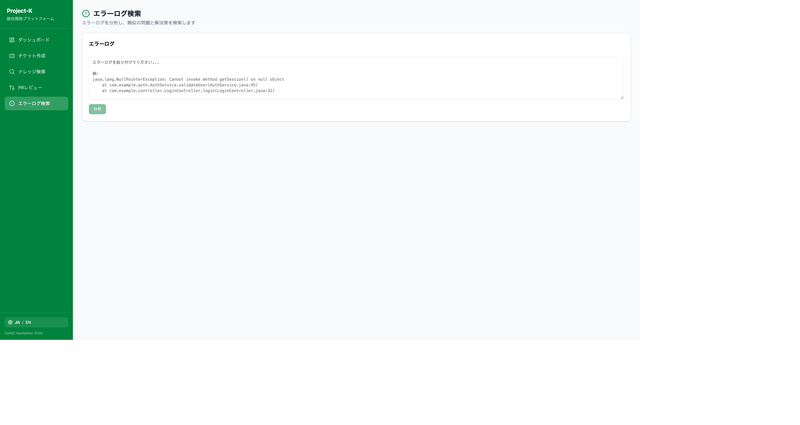
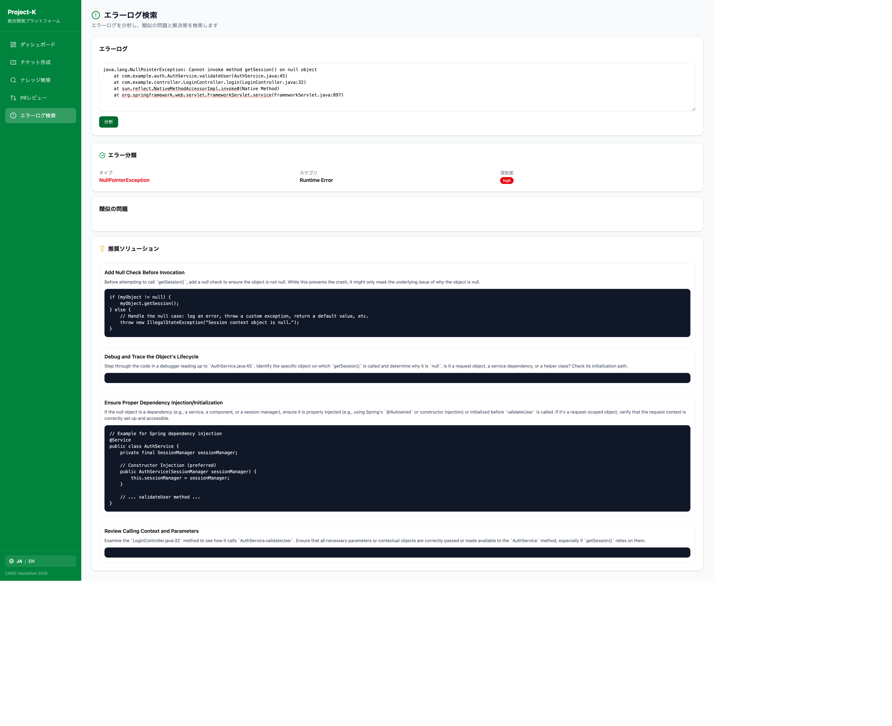

# Project-K Documentation

> CAINZ Hackathon 2026 - Developer Productivity Platform

## UI Screenshots

| Page | Screenshot |
|------|------------|
| Dashboard (日本語) |  |
| Dashboard (English) |  |
| JIRA Ticket Creation |  |
| JIRA AI Analysis Result |  |
| Knowledge Search |  |
| Knowledge Results |  |
| PR Review Page |  |
| PR Review AI Result |  |
| Error Log Input |  |
| Error Log AI Analysis |  |

---

## Documentation Structure

```
docs/
├── README.md                    # This file - Documentation hub
├── setup/                       # Getting started
│   ├── QUICKSTART.md            # Quick installation guide
│   └── ENVIRONMENT.md           # Environment variables reference
├── architecture/                # System design
│   ├── OVERVIEW.md              # High-level architecture
│   ├── FRONTEND.md              # React/Vite frontend structure
│   ├── BACKEND.md               # Plugins/Clients backend structure
│   └── API.md                   # API endpoints reference
├── features/                    # Feature documentation
│   ├── JIRA_AUTOMATION.md       # JIRA ticket generation
│   ├── KNOWLEDGE_SEARCH.md      # Unified knowledge search
│   ├── PR_REVIEW.md             # PR code review
│   └── ERROR_LOG.md             # Error log analysis
├── status/                      # Project status
│   └── CURRENT.md               # Current implementation status
└── i18n/                        # Translated docs
    ├── ARCHITECTURE_ja.md       # Japanese
    └── ARCHITECTURE_ko.md       # Korean
```

---

## Quick Links

### Getting Started
| Document | Description |
|----------|-------------|
| [Quick Start](setup/QUICKSTART.md) | Installation in 5 minutes |
| [Environment Setup](setup/ENVIRONMENT.md) | API keys and configuration |

### Architecture
| Document | Description |
|----------|-------------|
| [Overview](architecture/OVERVIEW.md) | System design and patterns |
| [Frontend](architecture/FRONTEND.md) | React + Vite + TypeScript |
| [Backend](architecture/BACKEND.md) | Plugins and shared clients |
| [API Reference](architecture/API.md) | REST endpoints |

### Features
| Document | Description |
|----------|-------------|
| [JIRA Automation](features/JIRA_AUTOMATION.md) | Natural language to JIRA tickets |
| [Knowledge Search](features/KNOWLEDGE_SEARCH.md) | Unified search (Confluence, JIRA, Teams, Web) |
| [PR Review](features/PR_REVIEW.md) | AI-powered code review |
| [Error Log](features/ERROR_LOG.md) | Error classification and solutions |

### Status
| Document | Description |
|----------|-------------|
| [Current Status](status/CURRENT.md) | Implementation progress and known issues |

---

## Legacy Documentation

These documents contain the original specifications (Japanese):

| Document | Description |
|----------|-------------|
| [DevFlow AI PRD](DevFlow_AI_PRD.md) | Product requirements (日本語) |
| [DevFlow AI PRD](DevFlow_AI_PRD_한글.md) | Product requirements (한국어) |
| [Design Spec](統合プラットフォーム_設計書.md) | Detailed design specification (日本語) |
| [Hackathon Guide](CAINZ_ハッカソン_完全ガイド.md) | Complete hackathon guide (日本語) |
| [Pitch Deck](DevFlow_AI_ピッチ.md) | Presentation pitch (日本語) |

---

## Tech Stack Summary

| Layer | Technologies |
|-------|--------------|
| Frontend | React 19, Vite 7, TypeScript 5.9, Tailwind CSS 4, shadcn/ui |
| Backend | TypeScript, Vite Middleware, Zod |
| AI | Google Gemini (gemini-2.5-flash) |
| Integrations | Atlassian (JIRA/Confluence), GitHub, Microsoft Teams |
| Testing | Vitest (96 tests passing) |

---

## Quick Commands

```bash
# Development
cd web && npm run dev          # Start dev server at http://localhost:5173

# Testing
npm test                       # Run all tests

# Build
cd web && npm run build        # Production build
```
